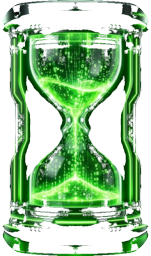

# ChronoArchiver

<div>

<strong>Time to Archive!</strong> — A unified media management platform for archival, classification, and transcoding.

ChronoArchiver consolidates date-based file organization, AI-driven image analysis, and batch AV1 encoding into a single desktop application. Built on PySide6 with an app-private Python environment; no system-wide package installation required.
</div>

[](https://github.com/UnDadFeated/ChronoArchiver/releases)
[](https://opensource.org/licenses/MIT)
[](#system-requirements)

---

## Overview

ChronoArchiver provides five core pillars for managing large media libraries:

| Module | Purpose |
|--------|---------|
| **Media Organizer** | Sorts photos and videos into date-based folder hierarchies using EXIF, filename, or metadata. |
| **Mass AV1 Encoder** | Batch transcodes video to AV1 with optional hardware acceleration. |
| **AI Media Scanner** | Classifies images by subject presence (faces, animals) for bulk triage and archival. |
| **AI Image Upscaler** | Z-Image-Turbo–style refinement (optional PyTorch/diffusers + HF models). |
| **AI Video Upscaler** | Real-ESRGAN (x2/x4+) frame upscaling with color tuning; source-frame preview; AV1 export via FFmpeg (optional PyTorch + weight download). |

Configuration is stored in the platform user-data directory. Each panel validates prerequisites before enabling execution; Start remains disabled until all required inputs (paths, models, etc.) are satisfied.

---

## Installation

Release **5.4.2** — installers and AUR `pkgver` are aligned on this version.

### GitHub (Windows / macOS installers)

Download from [**Releases**](https://github.com/UnDadFeated/ChronoArchiver/releases) (**tag `v5.4.2`**):

| Platform | Asset |
|----------|--------|
| Windows x64 | `ChronoArchiver-Setup-5.4.2-win64.exe` |
| macOS | `ChronoArchiver-Setup-5.4.2-mac64.zip` |

The installer is lightweight; the first launch may download Python-related components. **Python 3.11+** must be installed for this install path. Data: `%LOCALAPPDATA%\ChronoArchiver` (Windows) or `~/Library/Application Support/ChronoArchiver` (macOS).

### Git clone (Linux, Windows, macOS)

**Python 3.10+ is required.** FFmpeg is bundled.

```bash
git clone https://github.com/UnDadFeated/ChronoArchiver.git
cd ChronoArchiver
python src/bootstrap.py
```

Use `python src/bootstrap.py --reset-venv` to delete and recreate a broken app-private venv.

First launch creates an app-private venv (e.g. `~/.local/share/ChronoArchiver/venv` on Linux). Updates: run `git pull` and restart when prompted.

Maintainers: sync semver across `src/version.py`, `pyproject.toml`, `README.md`, `PKGBUILD`, and installer defaults with `python tools/bump_version.py X.Y.Z` from the repo root.

### Arch Linux (AUR)

Package **[chronoarchiver](https://aur.archlinux.org/packages/chronoarchiver)** at **5.4.2**:

```bash
paru -S chronoarchiver
# or
yay -S chronoarchiver
```

### Fedora Atomic (and similar immutable desktops)

Run [from git](#git-clone-linux-windows-macos) in toolbox/distrobox, or use an Arch container with the [AUR package](#arch-linux-aur).

---

## Technical overview & features

<a id="system-requirements"></a>

| | |
|--|--|
| **UI / runtime** | PySide6 (Qt), Python **3.10+**, bundled **FFmpeg** |
| **Media Organizer** | Date-based folders (nested or flat); EXIF, video metadata, filename, mtime; move / copy / symlink; optional **EXIF auto-rotate** for common raster photos (JPEG/PNG/WebP/TIFF/BMP/GIF); duplicates and dry-run |
| **AI Media Scanner** | OpenCV YuNet + optional YOLO ONNX; keep/move lists; models under user data (`Setup Models` / `Install OpenCV` in-app) |
| **Mass AV1 Encoder** | Queue with folder structure preserved; **SVT-AV1**, **NVENC** (e.g. RTX 40+), **VAAPI** / **AMF** where available; pause/resume |
| **AI Image Upscaler** | LANCZOS + Z-Image-Turbo img2img; real-time source edits; prompt-aware mode (**blank = cleanup/upscale only**); optional Beautify mode (local face analysis + optional BLIP captioning); optional LaMa inpainting for cleanup; in-app PyTorch/model setup with progress/speed telemetry |
| **AI Video Upscaler** | Official **Real-ESRGAN** RRDB weights (2× / 4× nets, 3× via resize); HSV saturation + brightness/contrast + optional unsharp; source-frame preview with adjustable color controls; AV1 export via FFmpeg (MP4/MKV) with optional audio copy |
| **Requirements** | **GPU optional** — hardware AV1/NVENC when supported; full software path otherwise |

**Privacy note (AI Media Scanner):** analysis runs locally on your machine. Selected images are processed on-device using OpenCV/ONNX and are not uploaded to any server.

**Diagnostics:** Use **COPY DEBUG INFO** or **EXPORT DIAGNOSTICS** in the footer to copy or save a local report. ChronoArchiver does **not** send this data to a server; attach it to a [GitHub issue](https://github.com/UnDadFeated/ChronoArchiver/issues) only if you choose. Security and privacy expectations: [SECURITY.md](SECURITY.md).

Full release notes: [CHANGELOG.md](CHANGELOG.md).

**Updates:** AUR (`paru`/`yay`), git clone (`git pull`), or Windows/macOS setup installer — see [CHANGELOG.md](CHANGELOG.md).

---

## Changelog

See [CHANGELOG.md](CHANGELOG.md). On Arch, the changelog is also installed at `/usr/share/doc/chronoarchiver/CHANGELOG.md`.

---

## Troubleshooting

| Issue | What to try |
|--------|-------------|
| **FFmpeg / prerequisites** | Wait for the footer line to show **READY** after startup. Use **HEALTH** in the footer for a quick summary. Open the **DEBUG** button to view session logs. |
| **Bundled FFmpeg missing or outdated** | From git installs, the app downloads **static-ffmpeg** into the venv on first run; ensure disk space and (for downloads) network access. |
| **GPU / CUDA / PyTorch** | GPU is optional. AI panels fall back to CPU; PyTorch and models can be installed from in-app flows. If you see **out of memory**, reduce resolution or close other GPU-heavy apps. |
| **Models or OpenCV** | Use each panel’s **Setup** / **Install** actions. **AI Media Scanner** needs OpenCV in the app venv; weights are stored under the app data directory. |
| **Offline** | Panels that need downloads show a **NO NETWORK** state; work that uses only local files still runs. |
| **Reporting bugs** | Use **COPY DEBUG INFO** or **EXPORT DIAGNOSTICS** (footer), then open an issue with steps to reproduce. |
| **Structured logs** | Set environment variable **`CHRONOARCHIVER_JSON_LOG=1`** before launch to also write `*_structured.jsonl` next to the session `.log` (machine-readable lines; still local only). |
| **Footer error line** | Recent **`ERROR:`** lines from the session logger appear briefly; they clear after a successful completion log for the same kind of task, or use **×**. **SHORTCUTS** (**Ctrl+/**) lists keys; **SECURITY** links to policy from the health dialog. |
| **Release notes** | After upgrading to a newer version, a one-time **what’s new** dialog may list highlights from **CHANGELOG.md** (not on a totally fresh install; dismissible; optional **do not show** for future upgrades). |

---

## Security

See [SECURITY.md](SECURITY.md) for vulnerability reporting, privacy, and supply-chain notes.

---

## Contributing

See [CONTRIBUTING.md](CONTRIBUTING.md) for the release checklist and what CI enforces.

---

## License

MIT License. See [LICENSE](LICENSE) for details.

---

*Maintained by [UnDadFeated](https://github.com/UnDadFeated)*
